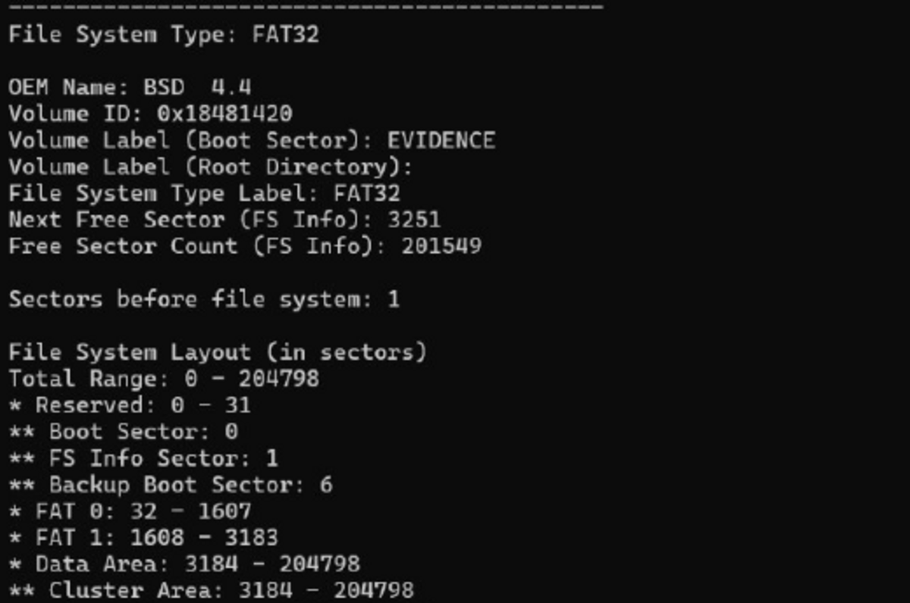
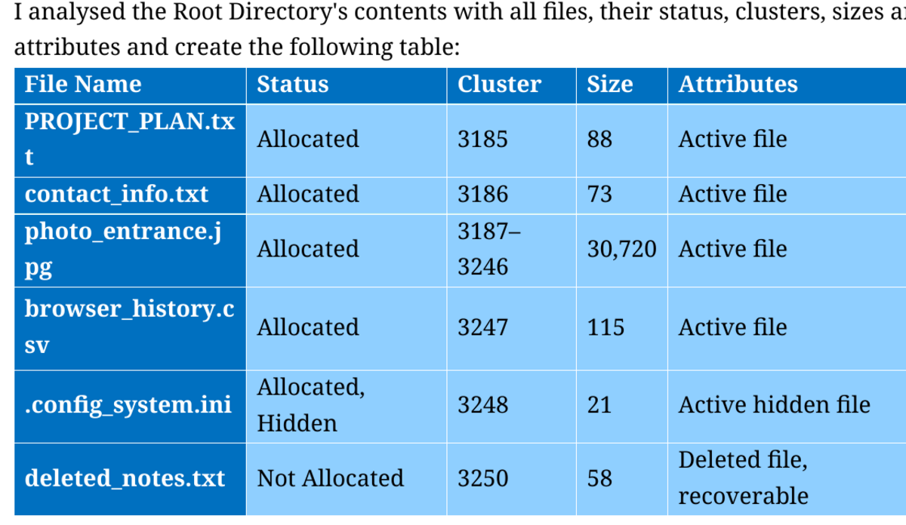
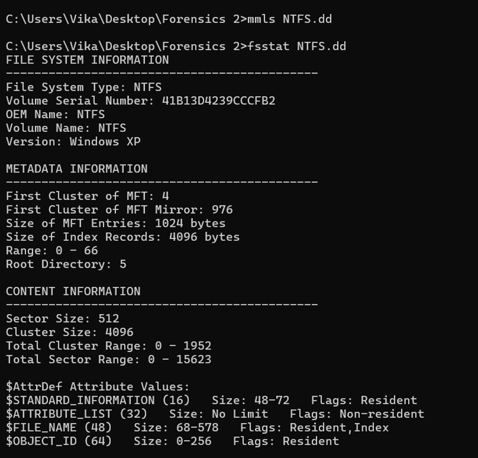
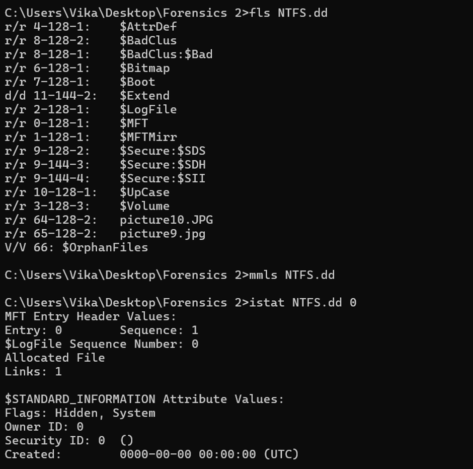
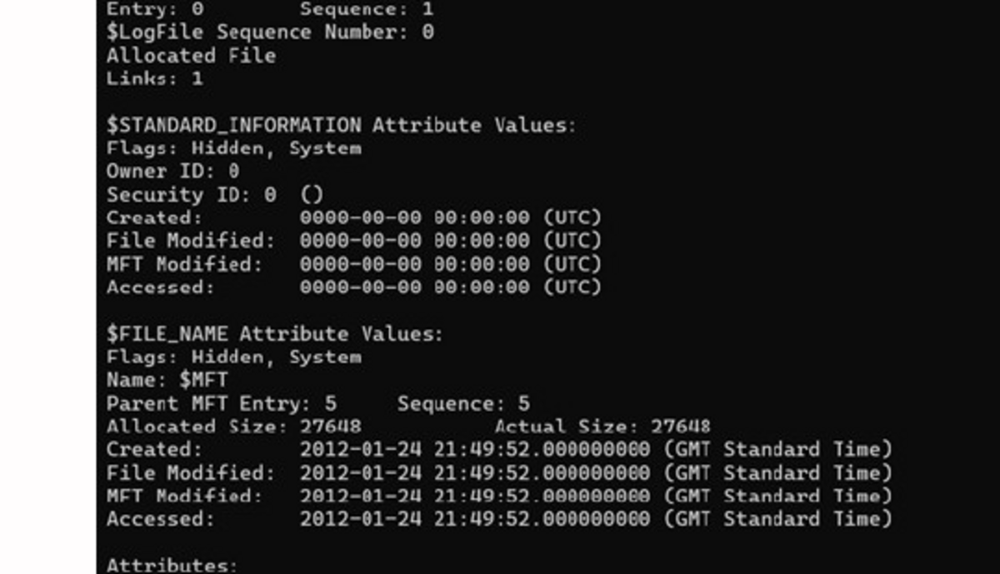
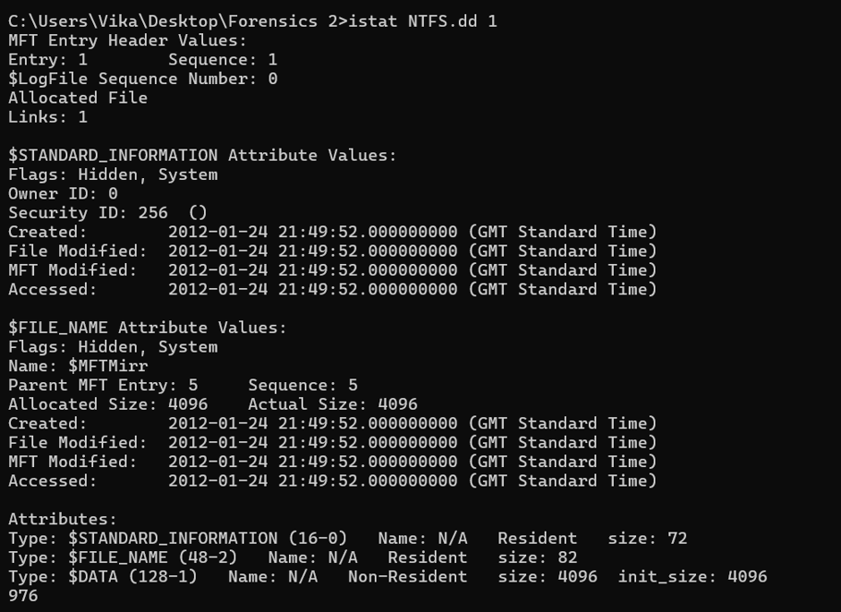
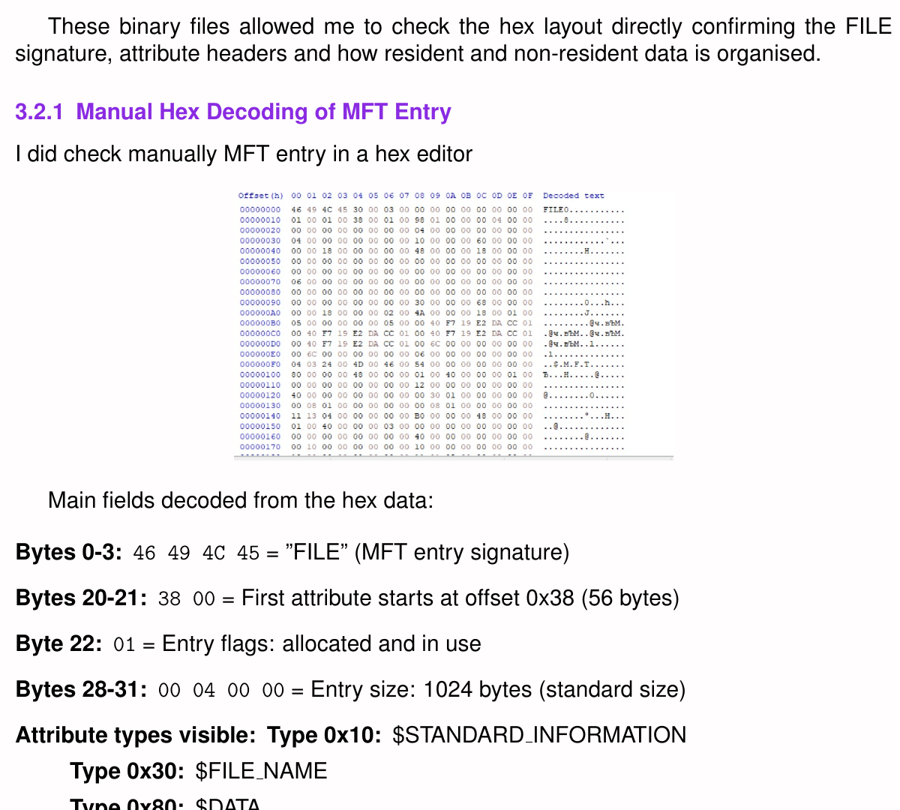

# File System Forensics Investigations

This repository presents selected work from two university file system forensics investigations covering FAT32 and NTFS disk images.

I used forensic tools and manual analysis to examine file system structures, identify allocated and deleted files, recover data and verify findings through metadata, timestamps, cluster allocation and NTFS MFT records.

## FAT32 Investigation

- Created and examined a forensic copy of a disk image
- Used The Sleuth Kit to inspect the partition and file system structure
- Identified allocated, hidden and deleted files
- Examined directory entries and cluster allocation
- Recovered and verified files using command-line tools and Autopsy

### FAT32 File System and Metadata

### Deleted File Investigation

The analysis identified `deleted_notes.txt` as an unallocated file whose directory entry and cluster information could still be examined.

## NTFS Investigation

- Manually decoded partition information and verified the findings using The Sleuth Kit
- Examined the Master File Table and MFT mirror
- Used `fsstat`, `fls`, `istat` and `icat` to inspect and extract data
- Analysed file metadata, timestamps, attributes and storage locations
- Compared resident and non-resident data
- Manually decoded an MFT entry using hexadecimal data
- Examined additional MFT entries and compared NTFS structures with FAT32

### NTFS File System Structure

I used `fsstat` to identify the sector and cluster sizes, the locations of `$MFT` and `$MFTMirr`, and the attribute types supported by the NTFS image.

### NTFS System Files

Using `fls`, I identified important NTFS system files, including `$MFT`, `$MFTMirr`, `$LogFile`, `$Bitmap` and `$Secure`, together with user files stored in the forensic image.

### NTFS MFT Analysis

### MFT Mirror Analysis

I examined `$MFTMirr` to understand how NTFS keeps backup copies of important MFT entries.

### Manual Hex Analysis

The MFT entry contained the `FILE` signature and the expected `$STANDARD_INFORMATION`, `$FILE_NAME` and `$DATA` attributes.

## Tools and Techniques

- Autopsy
- The Sleuth Kit
- `dd`
- Hex editor
- FAT32 directory and cluster analysis
- NTFS Master File Table analysis
- File recovery and metadata verification

## What I Learned

These investigations helped me understand how FAT32 and NTFS organise files, metadata and storage space. I learned how deleted data may remain recoverable until it is overwritten and how different forensic tools can be used together to verify findings.

I also gained practical experience interpreting directory entries, analysing cluster allocation and manually examining NTFS MFT records.

## Privacy and Academic Integrity

This repository contains a summary and selected redacted extracts from my work. Student information, assessment instructions, forensic images and recovered evidence files are not included.
